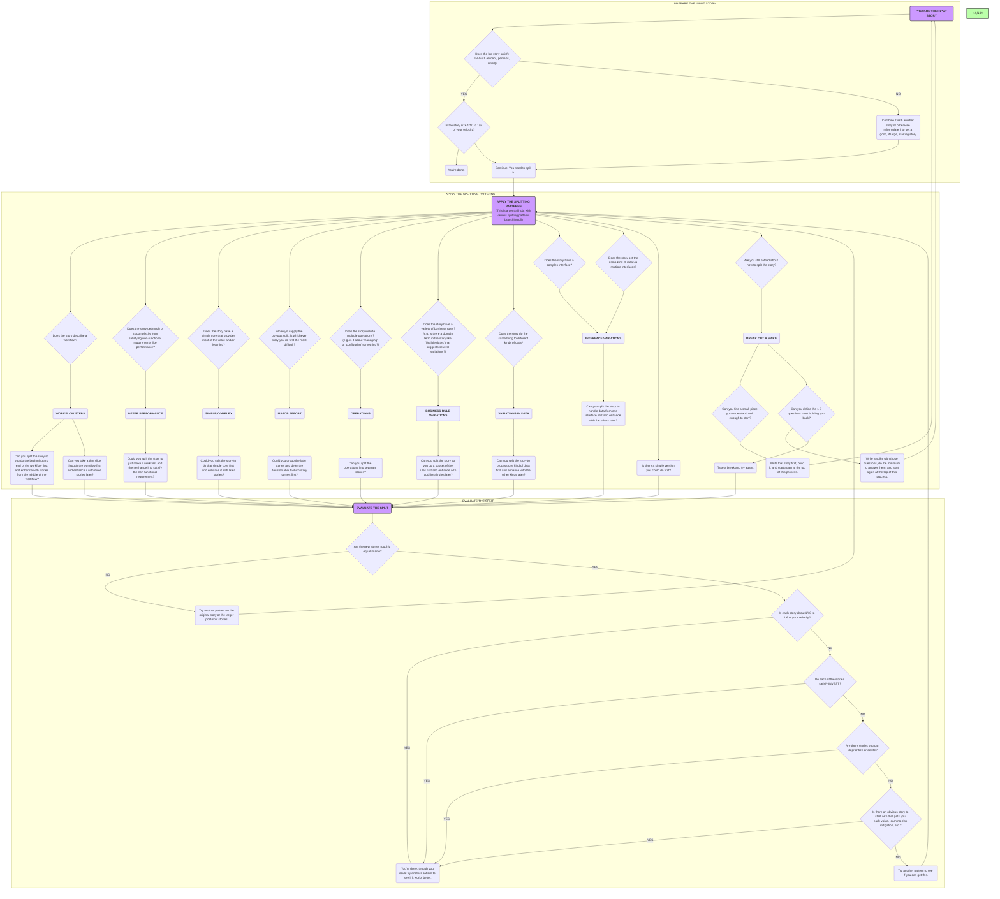

```mermaid
graph TD
    %% Part 1: Prepare the Input Story
    subgraph "PREPARE THE INPUT STORY"
        N1("<b>PREPARE THE INPUT STORY</b>")
        N1 --> N2{"Does the big story satisfy INVEST (except, perhaps, small)?"}
        
        N2 -- "YES" --> N3{"Is the story size 1/10 to 1/6 of your velocity?"}
        N3 --> N4("You're done.")
        N3 --> N5("Continue. You need to split it.")
        
        N2 -- "NO" --> N6("Combine it with another story or otherwise reformulate it to get a good, if large, starting story.")
        N6 --> N5
    end

    %% Part 2: Apply the Splitting Patterns
    subgraph "APPLY THE SPLITTING PATTERNS"
        N5 --> N7("<b>APPLY THE SPLITTING PATTERNS</b><br/>(This is a central hub, with various splitting patterns branching off)")
        
        N7 --> N8{"Does the story describe a workflow?"}
        N8 --> N9("<b>WORKFLOW STEPS</b>")
        N9 --> N10("Can you split the story so you do the beginning and end of the workflow first and enhance with stories from the middle of the workflow?")
        N9 --> N11("Can you take a thin slice through the workflow first and enhance it with more stories later?")

        N7 --> N12{"Does the story get much of its complexity from satisfying non-functional requirements like performance?"}
        N12 --> N13("<b>DEFER PERFORMANCE</b>")
        N13 --> N14("Could you split the story to just make it work first and then enhance it to satisfy the non-functional requirement?")

        N7 --> N15{"Does the story have a simple core that provides most of the value and/or learning?"}
        N15 --> N16("<b>SIMPLE/COMPLEX</b>")
        N16 --> N17("Could you split the story to do that simple core first and enhance it with later stories?")

        N7 --> N18{"When you apply the obvious split, is whichever story you do first the most difficult?"}
        N18 --> N19("<b>MAJOR EFFORT</b>")
        N19 --> N20("Could you group the later stories and defer the decision about which story comes first?")

        N7 --> N21{"Does the story include multiple operations?<br/>(e.g. is it about 'managing' or 'configuring' something?)"}
        N21 --> N22("<b>OPERATIONS</b>")
        N22 --> N23("Can you split the operations into separate stories?")

        N7 --> N24{"Does the story have a variety of business rules?<br/>(e.g. is there a domain term in the story like 'flexible dates' that suggests several variations?)"}
        N24 --> N25("<b>BUSINESS RULE VARIATIONS</b>")
        N25 --> N26("Can you split the story so you do a subset of the rules first and enhance with additional rules later?")

        N7 --> N27{"Does the story do the same thing to different kinds of data?"}
        N27 --> N28("<b>VARIATIONS IN DATA</b>")
        N28 --> N29("Can you split the story to process one kind of data first and enhance with the other kinds later?")

        N7 --> N30{"Does the story have a complex interface?"}
        N30 --> N31("<b>INTERFACE VARIATIONS</b>")
        N31 --> N32("Can you split the story to handle data from one interface first and enhance with the others later?")

        N7 --> N33{"Does the story get the same kind of data via multiple interfaces?"}
        N33 --> N31

        N7 --> N34("Is there a simple version you could do first?")

        N7 --> N35{"Are you still baffled about how to split the story?"}
        N35 --> N36("<b>BREAK OUT A SPIKE</b>")
        N36 --> N37{"Can you find a small piece you understand well enough to start?"}
        N37 --> N38("Write that story first, build it, and start again at the top of this process.")
        N38 --> N1
        N36 --> N39{"Can you define the 1-3 questions most holding you back?"}
        N39 --> N40("Write a spike with those questions, do the minimum to answer them, and start again at the top of this process.")
        N40 --> N1
        N39 --> N41("Take a break and try again.")
    end

    %% Part 3: Evaluate the Split
    subgraph "EVALUATE THE SPLIT"
        %% Connections from patterns to evaluation
        N10 --> N42("<b>EVALUATE THE SPLIT</b>")
        N11 --> N42
        N14 --> N42
        N17 --> N42
        N20 --> N42
        N23 --> N42
        N26 --> N42
        N29 --> N42
        N32 --> N42
        N34 --> N42
        N41 --> N42

        N42 --> N43{"Are the new stories roughly equal in size?"}
        N43 -- "NO" --> N44("Try another pattern on the original story or the larger post-split stories.")
        N44 --> N7

        N43 -- "YES" --> N45{"Is each story about 1/10 to 1/6 of your velocity?"}
        N45 -- "YES" --> N49
        N45 -- "NO" --> N46{"Do each of the stories satisfy INVEST?"}
        N46 -- "YES" --> N49
        N46 -- "NO" --> N47{"Are there stories you can deprioritize or delete?"}
        N47 -- "YES" --> N49
        N47 -- "NO" --> N48{"Is there an obvious story to start with that gets you early value, learning, risk mitigation, etc.?"}
        N48 -- "YES" --> N49("You're done, though you could try another pattern to see if it works better.")
        N48 -- "NO" --> N50("Try another pattern to see if you can get this.")
        N50 --> N7
    end
    
    %% Styling
    style N1 fill:#c9f,stroke:#333,stroke-width:2px
    style N7 fill:#c9f,stroke:#333,stroke-width:2px
    style N42 fill:#c9f,stroke:#333,stroke-width:2px
    style N4,N49 fill:#bfa,stroke:#333,stroke-width:2px
``` 